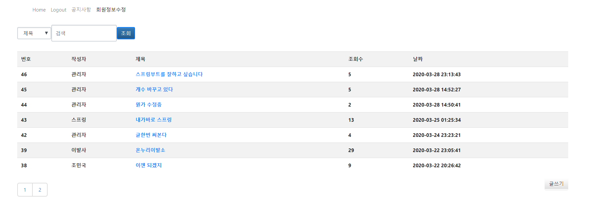
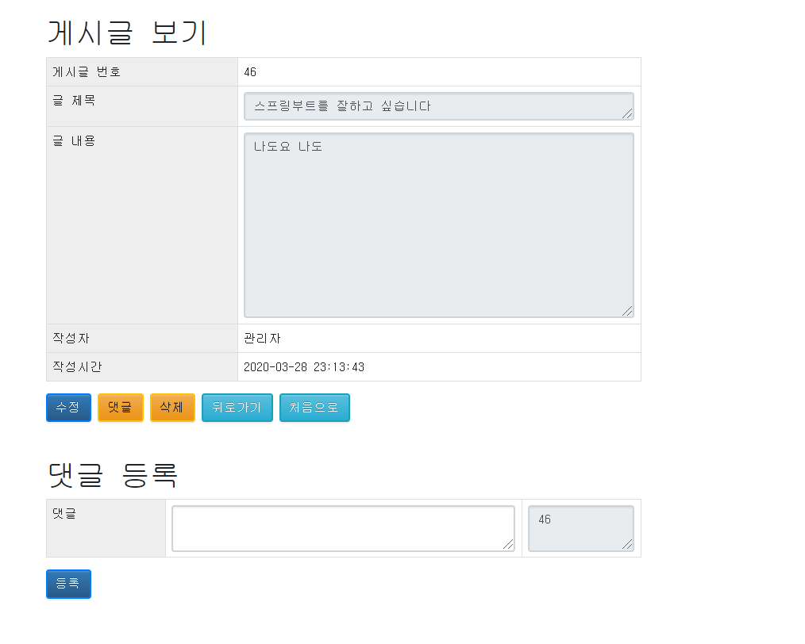
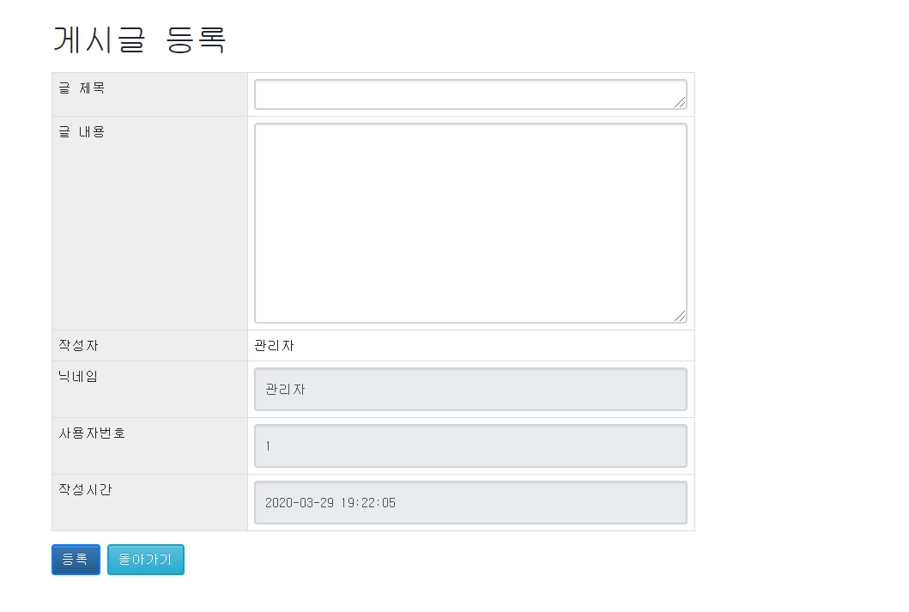
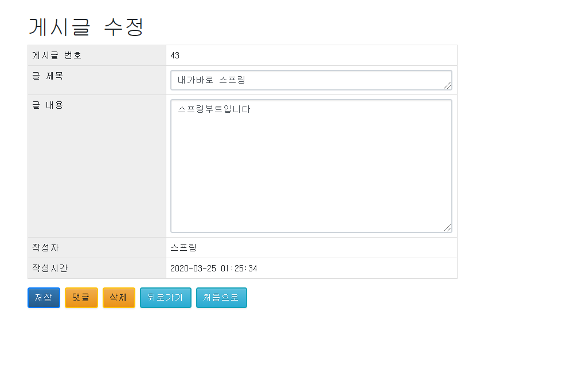

# Spring-boot 게시판 만들기

    🌱SpringBoot를 이용해 게시판을 만드는 공간

## View

---

---

---

---

## Use
* Spring Boot
* Tomcat
* JSP
* JDBC 
* MySQL

## Author
* 최정균 - [Gyun's develop](https://github.com/wjdrbs96)
